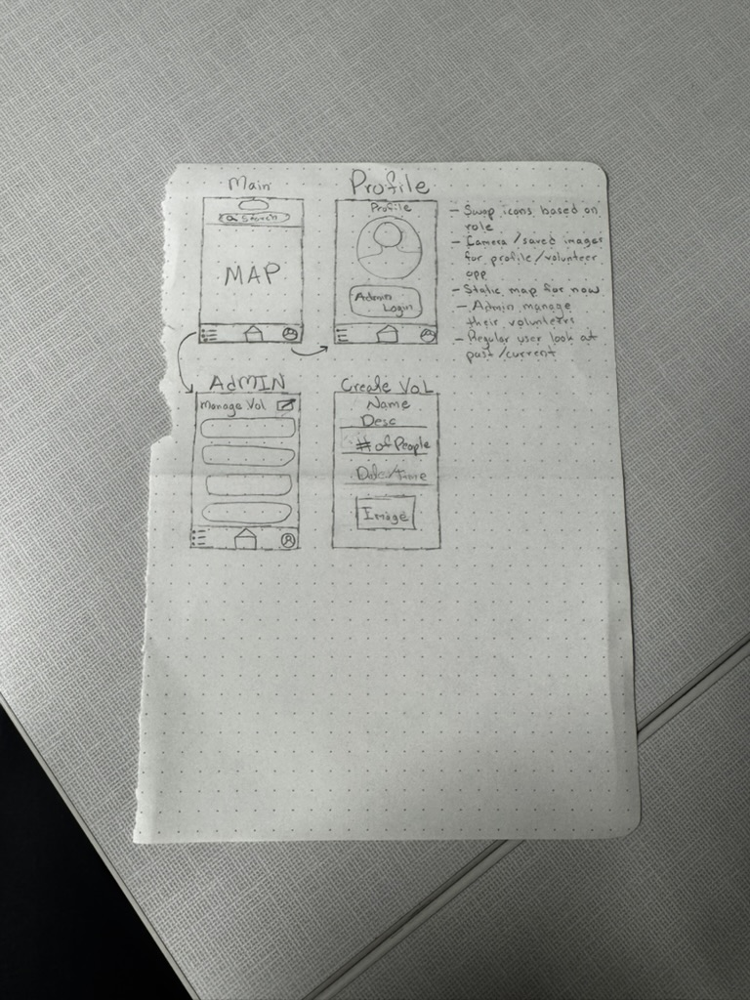

# Local Volunteer Finder

A React Native mobile application that connects volunteers with local community service opportunities. This app serves two user types: regular users who want to find and sign up for volunteer opportunities, and administrators who can create and manage volunteer events.

## Application Description

Local Volunteer Finder is a comprehensive volunteer management platform built with React Native and Expo. The app utilizes Google Maps integration to display volunteer opportunities on an interactive map, allowing users to discover events near them. Users can browse opportunities in both map and list views, filter by distance and categories, and track their volunteer commitments. Administrators have additional capabilities to create, edit, and delete volunteer opportunities, as well as manage volunteer sign-ups.

### Key Features

**For Regular Users:**

- Interactive map view showing volunteer opportunities with custom markers
- List view with detailed opportunity cards
- Filter opportunities by distance and up to 20 interest categories (Environment, Education, Community, Health, Animals, Arts & Culture, etc.)
- Sign up for or leave volunteer opportunities
- Track personal volunteer events in a dedicated "My Events" page
- Customizable user profile with bio, location, interests, and achievements
- Dark mode support

**For Administrators:**

- All regular user features plus administrative capabilities
- Create volunteer opportunities with full details (name, description, location, date/time, volunteer count, images, categories)
- Edit existing opportunities including updating categories and information
- Delete volunteer opportunities with confirmation
- Manage volunteers page showing all opportunities with volunteer counts
- View unfiltered opportunity list (filters only apply to regular users)

**Technical Features:**

- Google Places API integration for location autocomplete and geocoding
- AsyncStorage for local data persistence
- React Context for state management (User context, Theme context)
- Custom hooks for opportunities management
- Image upload via device camera or photo library
- Native date/time picker integration
- Real-time volunteer count tracking
- Haversine formula for distance calculations

## Wireframes

## Screenshots

[Add screenshots of your app here showing key features like the map view, list view, profile page, create opportunity modal, etc.]

## Human Interface Guidelines Implementation

### Light and Dark Mode Implementation

The app implements comprehensive light and dark mode theming using iOS standard blues (`#007AFF` for light, `#0A84FF` for dark) with true black backgrounds (`#000000`) in dark mode for OLED optimization. All UI components automatically adapt to the selected theme with proper WCAG AA contrast ratios, and the preference persists using AsyncStorage across app sessions.

### Touch Targets and Interactive Feedback

All interactive elements maintain the HIG-recommended minimum 44-point touch target size through appropriate padding, such as the 85px height bottom navigation and properly sized buttons. Interactive feedback uses scale transformations (`scale: 0.97`) and color changes on press, with buttons darkening to `#005BBB` in light mode and lightening to `#409CFF` in dark mode for clear visual confirmation.

### Loading States, Progress Indicators, and Navigation

The app uses a custom `LoadingIndicator` component with iOS activity indicators that adapt to the current theme, with an 800ms minimum loading time to prevent jarring flickers. Navigation follows iOS patterns with a bottom tab bar featuring clear icons and labels, enhanced with elevation and shadows for a floating effect, plus conditional navigation showing different tabs based on user roles (administrators see Manage instead of My Events).
